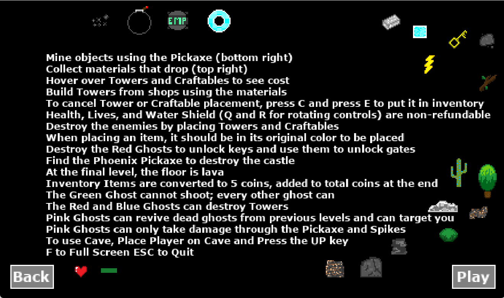

# Crafting Tower Defense Game


Welcome to the **Crafting Tower Defense Game**, a GameMaker Studio 2 project built to showcase a mix of crafting, resource management, and tower defense gameplay. This game features six unique levels, a Firebase-integrated leaderboard, and a variety of enemies and items to keep the player engaged. It was developed to deepen my understanding of GameMaker Language (GML) and to explore game development workflows.

---

## Table of Contents

- [Features](#features)
- [Gameplay Instructions](#gameplay-instructions)
- [Screenshots](#screenshots)
- [How to Play](#how-to-play)
- [Installation](#installation)

---

## Features

- **Inventory System**: Manage your resources, items, and craftables throughout the game.
- **Networked Leaderboard**: Firebase integration tracks top scores and players.
- **Variety of Items**: EMPs, bombs, spike traps, towers, and shields offer a range of strategic options.
- **Unique Enemies**: Challenge various enemies, including bosses, with special abilities.
- **Resource Collection**: Chop trees, mine materials, and use them to build defenses.
- **Six Levels**: Enjoy approximately 30 minutes of gameplay, culminating in an intense final level.
- **Boss Battles**: Face powerful foes in each level to test your strategy.

---

## Gameplay Instructions

- **Mine objects** using the Pickaxe.
- **Collect materials** that drop from trees and rocks.
- **Hover over Towers and Craftables** to see the cost.
- **Build Towers** from shops using the materials you collect.
- **Cancel Tower or Craftable placement** by pressing `C`, and press `E` to store the item in your inventory.
- **Non-refundable items** include Health, Lives, and Water Shield (use `Q` and `R` to rotate).
- **Place Towers and Craftables** to destroy enemies.
- **Red Ghosts**: Destroy to unlock keys and gates.
- **Use the Phoenix Pickaxe** to destroy the castle at the end.
- **In the final level**, beware of "the floor is lava!"
- **Convert inventory items to coins** (5 coins each) at the end of each level.
- **Ghost Abilities**:
  - **Green Ghost**: Cannot shoot.
  - **Red & Blue Ghosts**: Capable of destroying your Towers.
  - **Pink Ghost**: Revives fallen ghosts and targets the player.
- **Damage Mechanism**: Pink Ghosts can only be harmed with the Pickaxe or Spikes.
- **Caves**: Use by placing the player on the cave and pressing the `UP` key.
- **Toggle full-screen** with `F`. Quit the game using `ESC`.

---

## Screenshots

### Game Start


### Character Selection (Boy)


### Character Selection (Girl)


### Gameplay


### Leaderboard


---

## How to Play

1. Download and extract the **exe** build from the releases page.
2. Launch the game by double-clicking the `.exe` file.
3. Select your character and dive into the game.
4. Follow the instructions to collect materials, craft items, and defeat enemies to progress through the levels.

---

## Installation

1. Clone the repository:
   ```bash
   git clone https://github.com/jes4l/crafted-guardians
